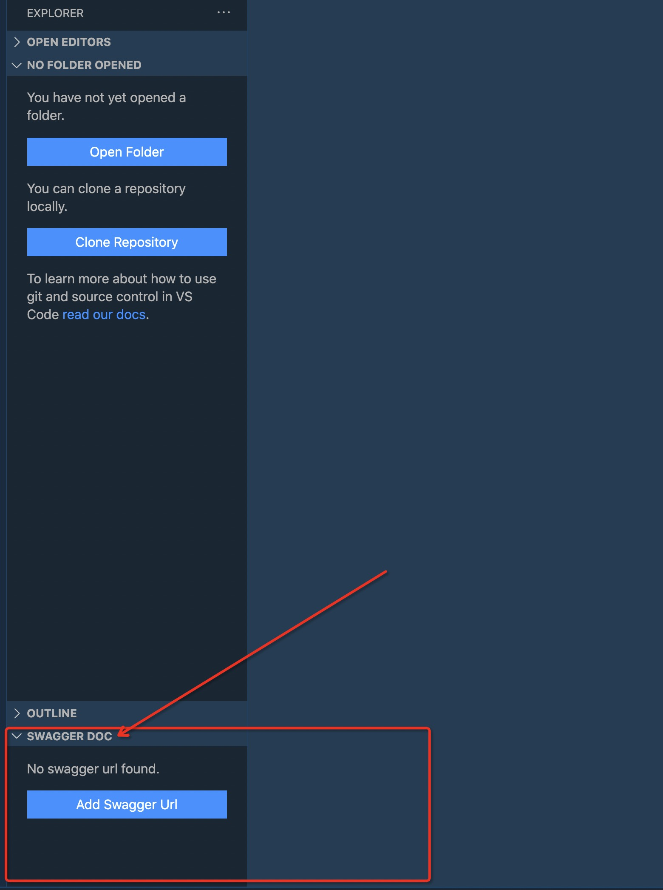
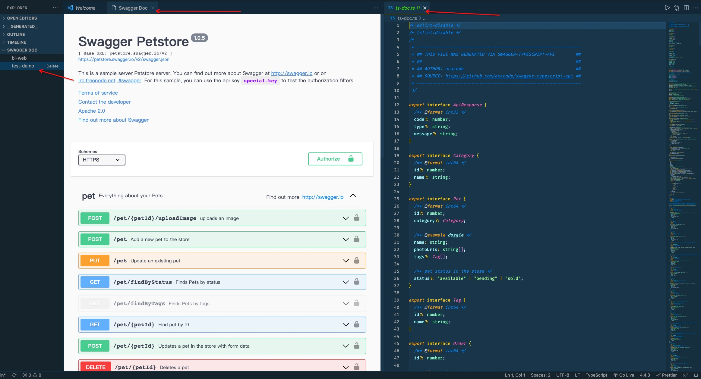

# swagger-panel

En: This extension is developed in order to view api docs in vscode panel. It supports configing multi swagger url.

Ch: 开发此插件的目的在于能在 vscode 里面浏览 swagger 文档，可以一边写 api 函数，一边查看接口文档，岂不是很爽 😄。它支持管理多个 swagger url，增删这些 swagger url。

## Features

after install this extension

**initial state**

**page view**

**add a new swagger url**

## Requirements

📢: the url must be swagger json url!!!

## Known Issues

---

**Enjoy!**
